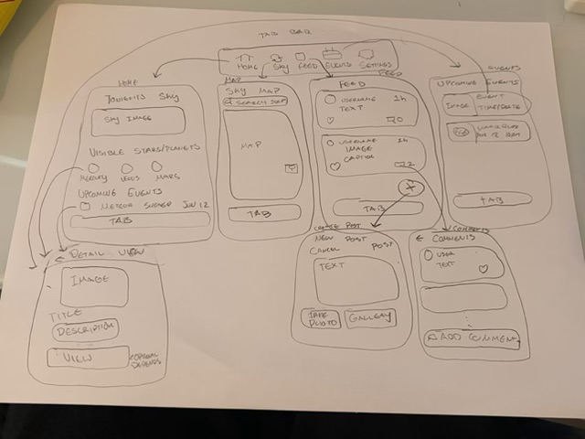
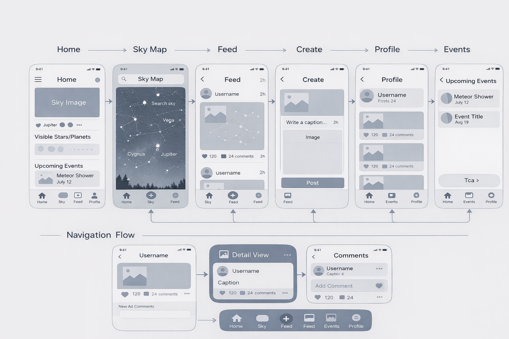

# 🌌 Astronomy App

## Table of Contents
1. Overview
2. Product Spec
3. Wireframes
4. Schema

---

## Demo

[Demo Video](https://youtu.be/GScVMhvVzmk)

---

## Overview

### Description
The Astronomy App is a mobile application that allows users to explore and understand the night sky in real time. By using location data and device sensors, the app identifies stars, planets, and constellations visible from the user’s location.

Users can also capture and share photos, browse NASA-powered content, and interact with a community of astronomy enthusiasts. The app combines education, exploration, and social interaction to make space engaging and accessible.

---

### App Evaluation

- **Category:** Education / Social / Lifestyle  
- **Mobile:** Yes — designed primarily for mobile (iOS/Android)  
- **Story:** Helps users discover and understand space while sharing experiences with others  
- **Market:** Students, hobbyists, and space enthusiasts worldwide  
- **Habit:** Occasional to moderate use (especially during stargazing or celestial events)  
- **Scope:** Medium to broad (real-time sky tracking + social features + API integration)  

---

## Product Spec

### 1. User Stories

#### Required Must-have Stories
- [x] User can register and log into an account  
- [x] User can view a basic Home screen/feed  
- [ ] User can remain logged in across sessions  
- [ ] User can view the Home screen with sky highlights and visible objects  
- [ ] User can view upcoming celestial events on the Home screen  
- [ ] User can navigate to the Sky Map to explore constellations  
- [ ] User can search and identify celestial objects in the Sky Map  
- [ ] User can view a Feed of user posts  
- [ ] User can create a post with an image and caption  
- [ ] User can navigate between tabs (Home, Sky Map, Feed, Create, Profile, Events)  
- [x] User can tap a profile icon or tab to view their Profile screen  
- [ ] User can view their profile information and posts  
- [ ] User can view upcoming celestial events in the Events screen  
- [ ] User can log out of their account  

#### Optional Nice-to-have Stories
- [ ] User can like posts  
- [ ] User can comment on posts  
- [ ] User can view number of likes and comments on a post  
- [ ] User can open a Comments screen for a post  
- [ ] User can follow other users  
- [ ] User can edit their profile (username, profile image)  
- [ ] User can receive notifications for events  
- [ ] User can save favorite celestial objects  
- [ ] User can enable AR sky tracking mode  
- [ ] User can message other users  

---

### 2. Screen Archetypes

- **Auth Screen (Login / Signup)**  
  - [x] User can log in  

- **Home Screen**  
  - [x] User can view basic feed layout  
  - [ ] User can view sky highlights  
  - [ ] User can view upcoming events  

- **Sky Map Screen**  
  - [ ] User can explore constellations  
  - [ ] User can search the sky  

- **Feed Screen**  
  - [ ] User can view posts from other users  

- **Create Screen**  
  - [ ] User can upload an image  
  - [ ] User can write a caption  
  - [ ] User can post content  

- **Profile Screen**  
  - [ ] User can view profile info  
  - [ ] User can view their posts  

- **Events Screen**  
  - [ ] User can view upcoming celestial events  

#### Optional Screens
- **Post Detail View**  
  - [ ] User can view a post in detail  

- **Comments Screen**  
  - [ ] User can read and add comments  

---

### 3. Navigation

#### Tab Navigation (Tab to Screen)
- [ ] Home → Home Screen  
- [ ] Sky Map → Sky Map Screen  
- [ ] Feed → Feed Screen  
- [ ] Create → Create Screen  
- [ ] Profile → Profile Screen  
- [ ] Events → Events Screen  

---

#### Flow Navigation (Screen to Screen)

- **Auth Screen**  
  → Leads to Home Screen  

- **Home Screen**  
  → Leads to Sky Map Screen  
  → Leads to Feed Screen  
  → Leads to Create Screen  
  → Leads to Profile Screen  
  → Leads to Events Screen  

- **Feed Screen**  
  → (Optional) Leads to Post Detail View  
  → (Optional) Leads to Comments Screen  

- **Profile Screen**  
  → Can log out → Auth Screen

---

---

## Wireframes

---

## [BONUS] Digital Wireframes & Mockups

---

## [BONUS] 

![Prototype] https://www.figma.com/design/rvceHaUh0ibTxoIphUCAyd/Astronomy-app-wireframe-navigation-flow?node-id=2-4&t=c5Qb0km21iTCdbnY-1

---

## Schema

### Models

#### User
| Property | Type | Description |
|----------|------|------------|
| id | String | unique user id |
| username | String | user's display name |
| email | String | user email |
| password | String | user password |
| profileImage | String | profile image URL |

---

#### Post
| Property | Type | Description |
|----------|------|------------|
| id | String | unique post id |
| userId | String | creator of post |
| image | String | image URL |
| caption | String | post caption |
| createdAt | Date | timestamp |

---

#### Comment
| Property | Type | Description |
|----------|------|------------|
| id | String | unique comment id |
| postId | String | associated post |
| userId | String | comment author |
| text | String | comment content |
| createdAt | Date | timestamp |

---

#### Event
| Property | Type | Description |
|----------|------|------------|
| id | String | event id |
| title | String | event name |
| date | Date | event date |
| description | String | event details |

---

### Networking

#### Home Feed
- `[GET] /posts` → retrieve all posts  
- `[POST] /posts` → create a new post  

#### Comments
- `[GET] /posts/:id/comments` → get comments  
- `[POST] /comments` → add comment  

#### User
- `[POST] /register` → create account  
- `[POST] /login` → login user  
- `[GET] /users/:id` → get user profile  

#### Events
- `[GET] /events` → retrieve upcoming celestial events  

#### NASA API
- `[GET] https://api.nasa.gov/planetary/apod` → Astronomy Picture of the Day  

---
